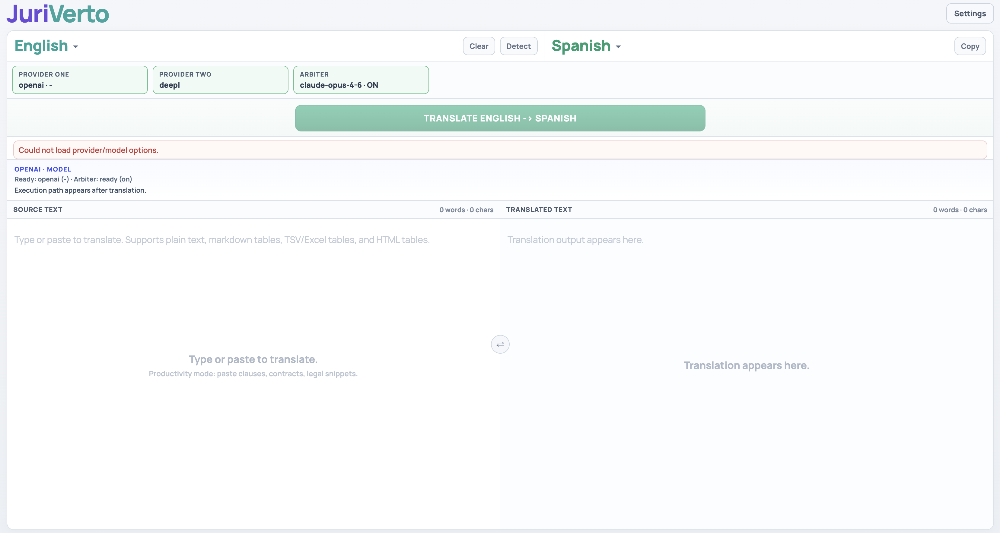

# JuriVerto

JuriVerto est une application de traduction orientee legal/enterprise avec:
- 2 providers de traduction (Provider One + Provider Two),
- un mode **Arbiter** (Claude) pour choisir entre deux candidats,
- une preservation forte du format (tableaux, numerotation, gras/souligne, structure),
- une trace d'execution pour la transparence.

## Screenshot



## Stack

- Frontend: React + Vite (`/frontend`)
- Backend: FastAPI (`/backend`)

## Fonctionnalites principales

- Choix provider/model (OpenAI, DeepL)
- Arbiter Claude (`claude-sonnet-4-6` ou `claude-opus-4-6`)
- Fallback scoring configurable:
  - `strict_legal`
  - `balanced`
- Verification de cles API depuis l'UI
- Preservation de structure tabulaire:
  - HTML table
  - Markdown table
  - TSV/Excel tabulaire
- Panneau de trace (debug) pour voir le chemin d'execution

## Prerequis

- Node.js 18+
- Python 3.11+

## Installation

### 1) Backend

```bash
cd /Users/WaelWorkTest/MyApps/JuriVerto/backend
python3 -m venv .venv
source .venv/bin/activate
pip install -r requirements.txt
```

### 2) Frontend

```bash
cd /Users/WaelWorkTest/MyApps/JuriVerto/frontend
npm install
```

## Demarrage (mode recommande)

### Terminal A: Backend (port 8001)

```bash
cd /Users/WaelWorkTest/MyApps/JuriVerto/backend
source .venv/bin/activate
uvicorn main:app --host 127.0.0.1 --port 8001
```

### Terminal B: Frontend (port 5176)

```bash
cd /Users/WaelWorkTest/MyApps/JuriVerto/frontend
npm run dev -- --host 127.0.0.1 --port 5176 --strictPort
```

Ouvrir: [http://127.0.0.1:5176](http://127.0.0.1:5176)

## Variante (frontend sur 8001)

Si tu veux exposer l'UI sur `8001`, fais tourner le backend sur un autre port (ex: `8003`) et passe `VITE_API_BASE_URL`.

### Backend sur 8003

```bash
cd /Users/WaelWorkTest/MyApps/JuriVerto/backend
source .venv/bin/activate
uvicorn main:app --host 127.0.0.1 --port 8003
```

### Frontend sur 8001 (avec base API explicite)

```bash
cd /Users/WaelWorkTest/MyApps/JuriVerto/frontend
VITE_API_BASE_URL=http://127.0.0.1:8003 npm run dev -- --host 127.0.0.1 --port 8001 --strictPort
```

Ouvrir: [http://127.0.0.1:8001](http://127.0.0.1:8001)

## Configuration

### Variables backend

- `PORT` (defaut: `8001`)
- `PRIMARY_PROVIDER` (defaut: `openai`)
- `FALLBACK_PROVIDER` (defaut: `deepl`)
- `SIMULATE_PRIMARY_FAILURE` (`true/false`, defaut: `false`)

### Variables frontend

- `VITE_API_BASE_URL` (optionnel)
  - Vide: utilise `/api/...` via proxy Vite
  - Renseigne: appelle directement cette base URL
- `VITE_SHOW_TRACE=1` pour activer la trace par defaut

## Endpoints API (backend)

- `GET /` -> status simple
- `GET /health`
- `GET /api/v1/providers`
- `GET /api/v1/providers/health`
- `POST /api/v1/keys/validate`
- `POST /api/v1/translate`

## Exemple payload traduction

```json
{
  "sourceText": "Section 301. The parties agree...",
  "sourceLang": "English",
  "targetLang": "French",
  "domain": "legal",
  "strictness": "strict",
  "selectedProvider": "openai",
  "selectedModel": "gpt-4.1",
  "fallbackProvider": "deepl",
  "providerApiKeys": {
    "openai": "sk-...",
    "deepl": "..."
  },
  "arbiter": {
    "enabled": true,
    "provider": "anthropic",
    "model": "claude-opus-4-6",
    "apiKey": "sk-ant-...",
    "fallbackMode": "strict_legal"
  },
  "debug": true
}
```

## Notes securite

- Les cles API sont configurees depuis l'UI.
- Elles sont conservees cote navigateur (localStorage: `juriverto.settings.v1`).
- Le backend les recoit dans la requete de traduction/validation et ne les renvoie jamais dans la reponse.

## Depannage

### "Could not load provider/model options."

- Verifier que le backend tourne et repond:
  - [http://127.0.0.1:8001/api/v1/providers](http://127.0.0.1:8001/api/v1/providers)
- Verifier le mapping frontend/backend (proxy Vite ou `VITE_API_BASE_URL`).

### L'UI affiche une autre app (T-800, landing, etc.)

- Verifier quel process ecoute sur le port:
  - `lsof -nP -iTCP:8001 -sTCP:LISTEN`
- Relancer JuriVerto sur un port dedie (`5176` recommande).

### "Missing API key" / erreur 401

- Ouvrir `Settings`, sauvegarder et verifier les cles:
  - OpenAI (provider one)
  - DeepL (provider two)
  - Anthropic (si Arbiter ON)

## Structure du projet

```text
JuriVerto/
  backend/
    main.py
    requirements.txt
  frontend/
    src/
      App.jsx
      api.js
      components/
    package.json
    vite.config.js
```
